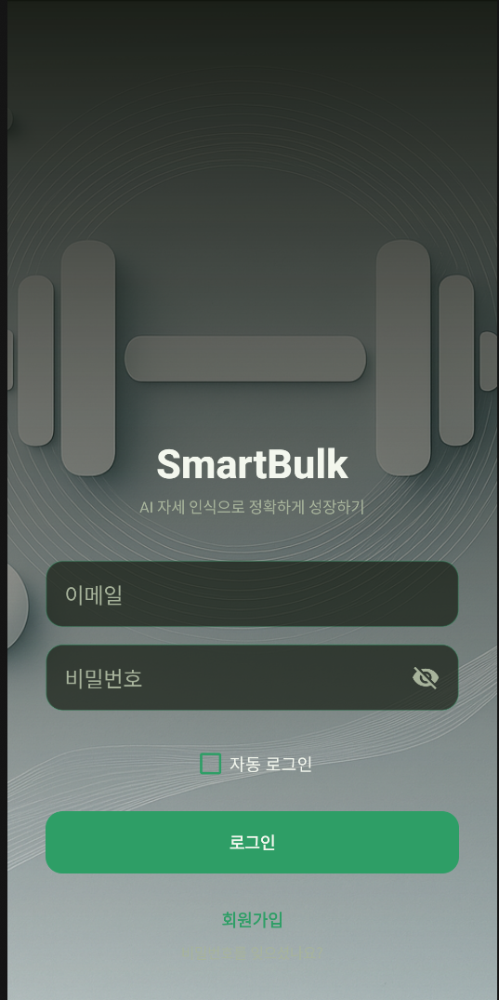
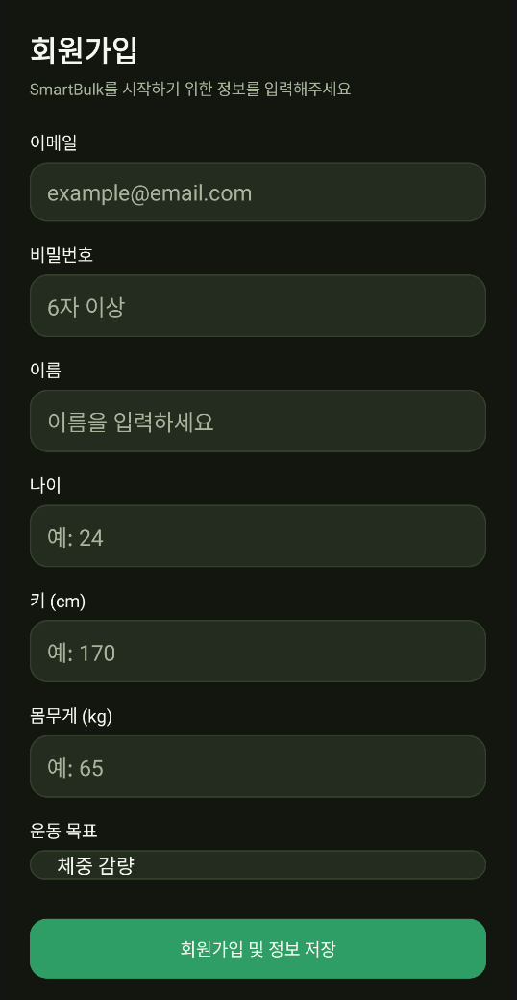
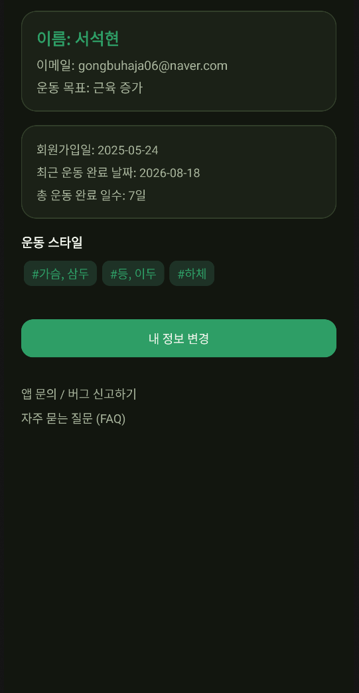
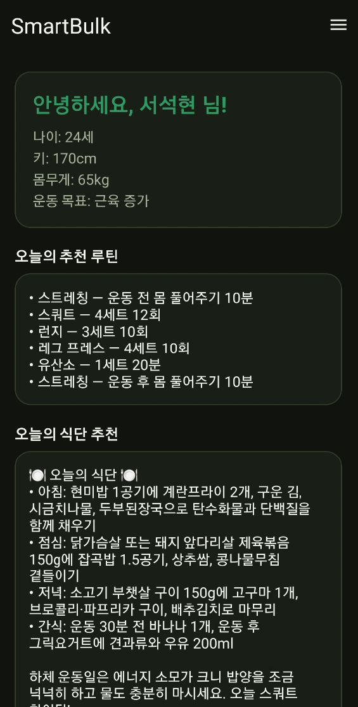
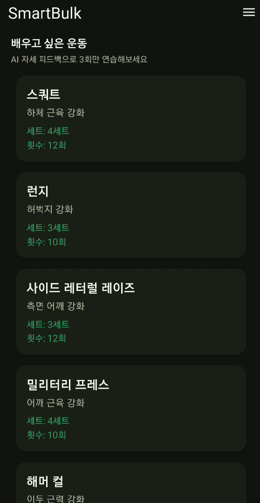
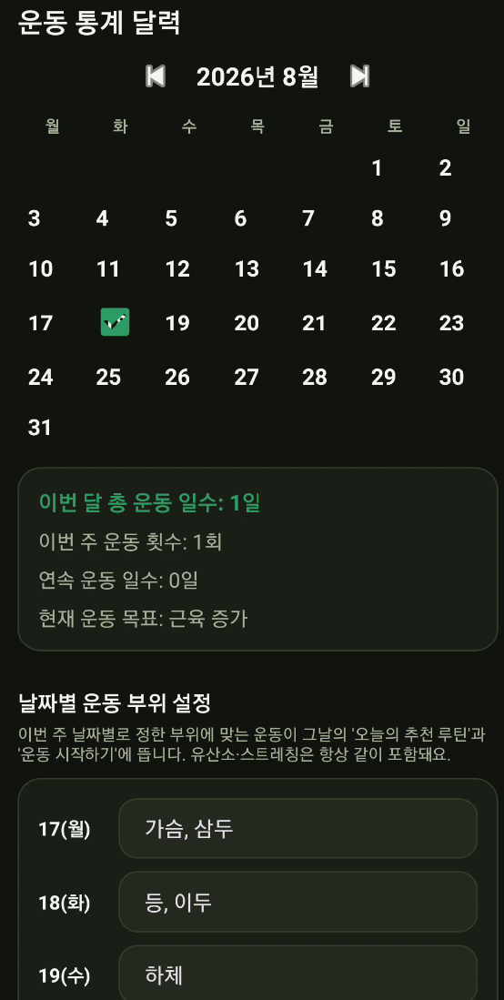
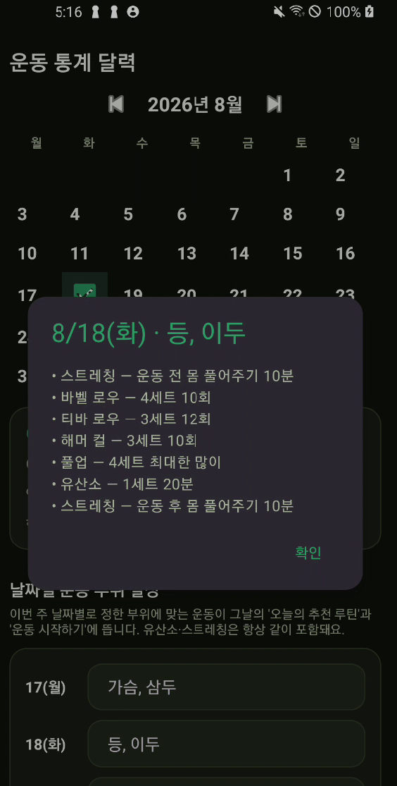
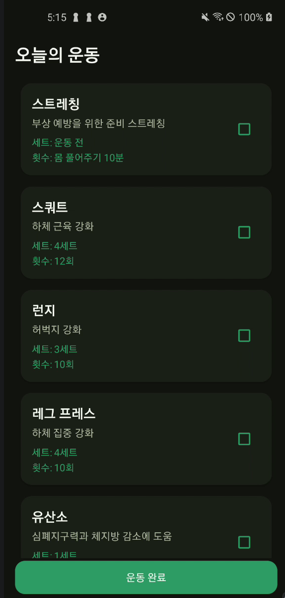
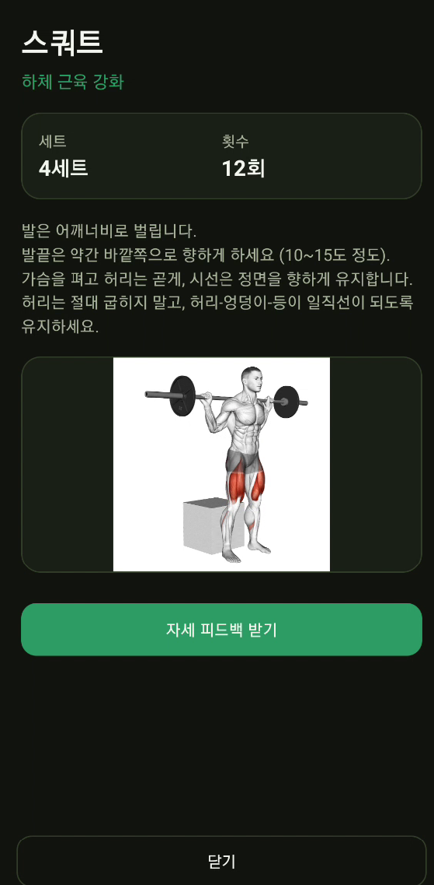
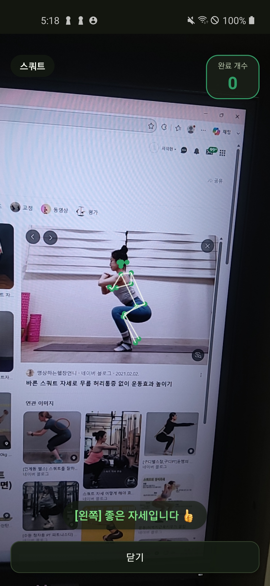

# SmartBulk

AI 기반 개인 맞춤 운동 추천, 실시간 자세 피드백, AI 식단 추천을 제공하는 Android 헬스케어 애플리케이션

## 프로젝트 소개

SmartBulk는 사용자의 신체 정보(나이, 키, 몸무게)와 운동 목표, 그리고 날짜별로 직접 설정한 운동 부위 계획을 바탕으로 맞춤 운동 루틴을 추천합니다. 카메라로 실시간 자세를 인식해 운동 중 피드백을 제공하고, 그날 운동 부위에 맞춰 Claude(Anthropic)가 생성한 식단을 추천합니다.

## 주요 기능

### 사용자 관리
- 회원가입 / 로그인 (자동 로그인 지원)
- Firebase Realtime Database 기반 프로필 저장
- 운동 목표 설정

### 날짜별 맞춤 운동 계획
- 통계 화면에서 이번 주 날짜별로 운동 부위(가슴·삼두 / 등·이두 / 하체 / 어깨 / 휴식)를 직접 설정
- 메인 화면의 "오늘의 추천 루틴"과 "운동 시작하기"가 항상 동일한 기준으로 같은 루틴을 보여줌
- 모든 루틴은 [준비 스트레칭 → 부위별 운동 → 유산소 → 마무리 스트레칭] 순서로 자동 구성
- "오늘의 운동" 화면에서 운동마다 완료 체크박스를 제공하고, 전부 체크해야 "운동 완료" 버튼이 활성화되는 체크리스트 방식
- 달력에서 날짜를 탭하면 그날의 계획을 미리보기로 확인 가능, 완료한 날짜는 달력에 표시

### 카메라 기반 자세 피드백
- TensorFlow Lite MoveNet으로 온디바이스 포즈 추정 (회전 보정, 정사각형 크롭, 프레임별 관절 좌표 추출)
- 운동마다 독립된 판정 로직(`ExerciseAnalyzer`)을 두어, 운동 종류에 맞는 자세 규칙과 반복 횟수 카운팅을 적용
- 스쿼트·런지·사이드 레터럴 레이즈·밀리터리 프레스·해머 컬·케이블 푸쉬다운·덤벨 트라이셉스 익스텐션·바벨 로우·티바 로우·풀업 등 10종 운동 지원
- 메인 화면 "배우고 싶은 운동"에서 지원 운동을 골라 3회까지만 카운트하는 연습 모드로 자세를 미리 익힐 수 있음

### AI 식단 추천
- 사용자 프로필과 그날 운동 부위를 바탕으로 Claude(Anthropic API)가 아침·점심·저녁·간식과 한줄 팁을 생성
- Anthropic API 키는 클라이언트에 두지 않고 Firebase Cloud Functions에서만 사용해, 앱 바이너리에 키가 노출되지 않도록 설계
- 같은 날짜의 추천은 Realtime Database에 캐싱해 하루 한 번만 실제 API를 호출

### 운동 통계
- 이번 달 총 운동 일수, 이번 주 운동 횟수, 연속 운동 일수 집계
- 달력에 요일 헤더와 완료 여부를 함께 표시

## 기술 스택

### Mobile
- Kotlin, Android (ViewBinding / DataBinding)
- CameraX
- Material 3 기반 다크 테마 UI

### Backend / Cloud
- Firebase Authentication
- Firebase Realtime Database
- Firebase Cloud Functions (Node.js / TypeScript) — Anthropic API 프록시 및 결과 캐싱

### AI / Computer Vision
- TensorFlow Lite MoveNet — 온디바이스 실시간 포즈 추정
- Anthropic Claude API — 서버 사이드 식단 추천 생성 (구조화된 JSON 출력)

## 프로젝트 구조

```text
app/
 ├── MainActivity                 로그인 후 첫 화면 — 프로필, 오늘의 루틴, 식단 추천, 배우고 싶은 운동
 ├── StatisticsActivity           날짜별 운동 부위 설정, 달력, 운동 통계
 ├── WorkoutDetailActivity        오늘의 운동 목록 + 완료 체크리스트
 ├── ExerciseDetailActivity       운동 상세 설명 + 자세 피드백 진입점
 ├── PoseFeedbackActivity         카메라 프리뷰 + 실시간 자세 판정 화면
 ├── MoveNetPoseEstimator         카메라 프레임 → 관절 좌표 추론 (모델/카메라 배관 담당)
 ├── ExerciseAnalyzer 구현체들     운동별 자세 판정 로직 (SquatAnalyzer, LungeAnalyzer 등)
 └── util/
      ├── WorkoutRecommender      목표·부위·날짜에 맞는 루틴 생성
      └── DietRecommender         Cloud Function 호출해 식단 추천 가져오기

functions/
 └── src/index.ts                 getDietRecommendation — Claude API 호출 + Realtime DB 캐싱
```

## 개발 과정에서의 한계와 문제점

### 1. 자세 인식 문제의 원인 분석

초기 개발에서는 스쿼트 자세 인식이 안정적으로 동작하지 않아 각도 임계값을 조정하는 방식으로 문제를 해결하려 했습니다. 그러나 재검증 과정에서 임계값 자체보다 카메라 프레임 처리 및 TFLite 입력 파이프라인에 문제가 있다는 것을 확인했습니다.

주요 원인은 다음과 같았습니다.

- **카메라 회전 보정 미적용**: CameraX `ImageAnalysis`에서 전달되는 프레임의 회전 정보를 별도로 처리하지 않아 실제 화면 방향과 분석 이미지의 방향이 일치하지 않는 문제가 발생했습니다.
- **YUV → RGB 변환 과정의 stride 처리 문제**: NV21/YUV 데이터를 픽셀 배열로 변환하는 과정에서 `rowStride`와 `pixelStride`를 고려하지 않아 이미지 데이터가 올바르게 구성되지 않는 문제가 있었습니다.
- **TFLite 입력 버퍼 초기화 문제**: 추론 전에 `ByteBuffer.rewind()`를 호출하지 않아 이전 위치의 버퍼 데이터를 읽는 문제가 발생할 수 있었습니다.
- **MoveNet 입력 데이터 범위 문제**: 입력 데이터를 0~1 범위로 정규화했지만, 사용 중인 모델의 입력 형식에 맞지 않아 올바른 추론 결과를 얻지 못하는 문제가 있었습니다.

이러한 문제들이 복합적으로 발생하면서 사람을 제대로 인식하지 못하거나, 임계값을 변경해도 자세 판정 결과가 불안정하게 나타났습니다.

### 2. 고정 임계값 방식의 한계

사용자의 촬영 각도, 카메라와의 거리, 신체 비율 등에 따라 동일한 자세에서도 관절 좌표와 각도가 달라질 수 있었습니다. 따라서 특정 각도 하나를 기준으로 자세를 판정하는 방식만으로는 다양한 사용자의 운동 자세를 안정적으로 일반화하기 어렵다는 한계를 확인했습니다.

### 3. 실기기 테스트의 중요성

카메라 프레임 처리와 ML 모델 추론 과정에서 발생하는 일부 문제는 코드만 검토했을 때 쉽게 발견하기 어려웠습니다. 실제 Android 기기에서 카메라를 실행하고 프레임을 분석하는 과정에서 문제를 재현할 수 있었으며, 이를 통해 실기기 기반 검증이 필요한 기능에서는 개발 초기부터 반복적인 테스트 환경을 구축하는 것이 중요하다는 점을 확인했습니다.

## 문제 해결 및 개선 과정

### 1. 자세 측정 로직 재설계

기존 코드를 부분적으로 수정하는 대신 자세 측정 관련 로직을 다시 설계했습니다. 카메라 및 모델 추론을 담당하는 `MoveNetPoseEstimator`와 운동별 자세 판정을 담당하는 `ExerciseAnalyzer`를 분리하여 이미지 처리와 운동 판정 로직의 책임을 구분했습니다. 이를 통해 특정 단계에서 문제가 발생했을 때 원인을 보다 쉽게 추적하고 수정할 수 있도록 구조를 개선했습니다.

### 2. 운동별 상태 머신 기반 판정

기존의 단일 임계값 중심 접근에서 벗어나 운동별 독립적인 판정 로직과 히스테리시스 기반 상태 머신을 적용했습니다. 예를 들어 운동 상태를 `UP`과 `DOWN`으로 구분하고 상태 전환 조건을 각각 다르게 설정하여, 임계값 주변에서 발생할 수 있는 반복 카운팅과 불안정한 상태 전환을 줄였습니다.

### 3. 카메라 및 모델 입력 파이프라인 수정

다음 항목을 실제 Android 기기에서 단계적으로 검증하며 수정했습니다.

- CameraX 프레임 회전 보정
- YUV/NV21 변환 과정의 `rowStride` 및 `pixelStride` 처리
- TFLite 추론 전 `ByteBuffer.rewind()` 적용
- MoveNet 모델에 맞는 입력 데이터 범위 적용

각 수정 사항을 실제 기기에서 확인하면서 카메라 → 이미지 변환 → 모델 입력 → 자세 추론 → 운동 판정으로 이어지는 전체 파이프라인을 검증했습니다.

### 4. 검증되지 않은 로직 명시

스쿼트를 제외한 일부 운동의 각도 임계값은 아직 다양한 실기기 및 사용자 환경에서 충분히 검증하지 못했습니다. 따라서 해당 로직에는 `⚠️` 주석을 표시하여 검증이 완료된 로직과 추정값을 구분했습니다. 이를 통해 구현되지 않은 기능이나 충분히 검증되지 않은 부분을 완성된 기능처럼 표현하지 않도록 했습니다.

## 추가 개발 및 기능 확장

### 운동 기능 확장

기존 스쿼트 1종에서 다음과 같이 총 10종의 운동으로 확장했습니다.

- 스쿼트
- 런지
- 사이드 레터럴 레이즈
- 밀리터리 프레스
- 해머 컬
- 케이블 푸쉬다운
- 덤벨 트라이셉스 익스텐션
- 바벨 로우
- 티바 로우
- 풀업

운동별로 자세 판정 로직을 분리하여 각 운동의 동작 특성에 맞게 판정 조건을 적용할 수 있도록 구성했습니다.

### 연습 모드

사용자가 새로운 운동의 자세를 연습할 수 있도록 별도의 연습 모드를 추가했습니다. 운동별로 최대 3회까지 동작을 수행한 후 세션을 종료하도록 구성하여, 본 운동에 들어가기 전에 자세를 익힐 수 있도록 했습니다.

### UI/UX 리디자인

기존 화면을 전체적으로 재설계하고 다크 테마와 포레스트 그린을 중심으로 한 일관된 브랜드 스타일을 적용했습니다. 또한 자세 피드백 카운터 UI, 회원가입 화면, 로그인 배경 등의 세부 UI를 개선했습니다.

### 날짜 기반 운동 계획

기존 요일 반복 방식에서 벗어나 통계 화면에서 날짜별 운동 부위를 직접 지정할 수 있도록 변경했습니다. 운동 계획 데이터를 기준으로 메인 화면과 운동 화면이 동일한 일정을 참조하도록 구성하여 화면별 데이터 불일치 문제를 줄였습니다.

### 오늘의 운동 체크리스트

운동별 완료 상태를 체크할 수 있는 체크리스트를 추가했습니다. 모든 운동을 완료한 경우에만 `운동 완료` 기능을 활성화하도록 구성하여 사용자가 당일 운동 진행 상황을 쉽게 확인할 수 있도록 했습니다.

### AI 식단 추천

Firebase Cloud Functions를 통해 Anthropic Claude API를 호출하는 AI 식단 추천 기능을 추가했습니다. 사용자의 프로필과 당일 운동 부위를 기반으로 맞춤형 식단을 추천하며, API Key는 클라이언트에 직접 노출하지 않고 서버 측에서 관리하도록 구성했습니다.

### Firebase 실데이터 연동

기존 더미 데이터를 사용하던 마이페이지를 실제 Firebase 데이터와 연동하여 사용자 정보를 실시간으로 표시하도록 개선했습니다.

## 향후 개선 방향

- 벤치프레스 / 레그프레스 / 시티드 체스트프레스 등 거치대가 필요하거나 기구에 가려지는 운동의 자세 분석 지원

## 실행 화면

<table>
  <tr>
    <td align="center"><br>로그인 화면</td>
    <td align="center"><br>회원가입 화면</td>
  </tr>
  <tr>
    <td align="center"><br>마이페이지</td>
    <td align="center"><br>메인 화면</td>
  </tr>
  <tr>
    <td align="center"><br>배우고 싶은 운동 목록</td>
    <td align="center"><br>통계/달력 화면</td>
  </tr>
  <tr>
    <td align="center"><br>통계 - 날짜 미리보기 다이얼로그</td>
    <td align="center"><br>오늘의 운동 - 체크박스</td>
  </tr>
  <tr>
    <td align="center"><br>운동 상세 화면 (스쿼트)</td>
    <td align="center"><br>스쿼트 인식 자세 피드백</td>
  </tr>
</table>

## 개발 기간

2025년 1학기 — 초기 개발 (수업 프로젝트)<br>
2026.08.03 ~ 2026.08.19 — 기능 개선 및 고도화

## 프로젝트를 통해 얻은 경험

초기 프로젝트에서는 자세 인식이 정상적으로 동작하지 않는 원인을 단순히 임계값 문제로 판단했지만, 재개발 과정에서 카메라 프레임 처리부터 ML 모델 입력, 추론 결과 처리까지 전체 데이터 파이프라인을 단계적으로 확인하는 것이 중요하다는 것을 경험했습니다.

또한 기존 기능을 단순히 추가하는 것보다 각 기능의 책임을 분리하고, 실제 기기에서 반복적으로 검증하는 과정이 안정적인 Android 애플리케이션을 만드는 데 중요하다는 것을 배웠습니다.
